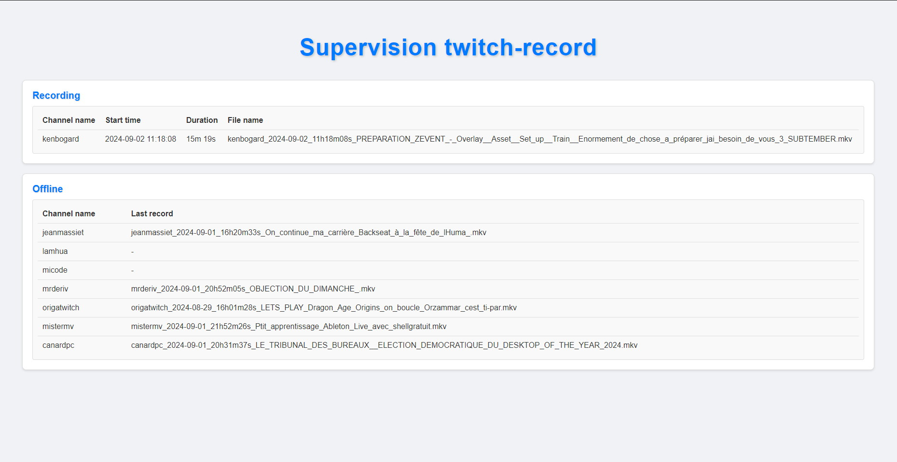

# Twitch stream recorder supervision

Webapp for monitoring [twitch-stream-recorder](https://github.com/ceplt/twitch-stream-recorder)



## Requirements

- Node 20 LTS
- [twitch-stream-recorder](https://github.com/ceplt/twitch-stream-recorder)

## Config

### Files

Conf files location
 
- `backend/src/config/`
- `frontend/src/config/`

### Env vars

- `REACT_APP_API_URL`, default value `http://localhost:3001`
- `CONFIG`, default value `../config/config.dev.json`

You can create and use `backend/.env` & `frontend/.env` files, or set system env vars

## Run

### Local

```shell
npm run install:all; npm run start
```

### With docker

Set parameters inside the script then run it to build (and push) the image

```shell
./scripts/build_and_push_with_docker.sh
```
Then run the docker image

```shell
docker run -d -p 3000:3000 [docker_image_name]
```
